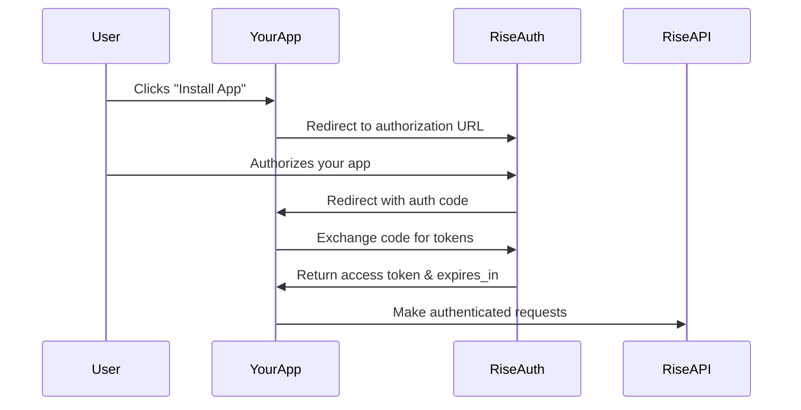

# Rise.ai OAuth Integration Tutorial

This tutorial walks you through implementing a complete Rise.ai OAuth integration step by step.

## Table of Contents

1. [Understanding OAuth 2.0 Flow](#understanding-oauth-20-flow)
2. [Setting Up Your Development Environment](#setting-up-your-development-environment)
3. [Implementing the Authorization Flow](#implementing-the-authorization-flow)
4. [Handling Tokens Securely](#handling-tokens-securely)
5. [Processing Webhooks](#processing-webhooks)
6. [Making API Calls](#making-api-calls)
7. [Production Considerations](#production-considerations)

## Understanding OAuth 2.0 Flow

Rise.ai uses the **Client Credentials** OAuth 2.0 flow for app integrations. Here's how it works:



## Setting Up Your Development Environment

### 1. Get Your Credentials

First, register your app in the Rise.ai developer dashboard:

1. Go to [Rise.ai Developer Console](https://developer.rise.ai)
2. Create a new application
3. Note down your `CLIENT_ID` and `CLIENT_SECRET`
4. Set your redirect URI to `http://localhost:3000/oauth/rise/callback`

### 2. Environment Setup

Copy `.env.example` to `.env` and fill in your credentials:

```bash
cp .env.example .env
```

Edit `.env`:
```env
CLIENT_ID=your_actual_client_id
CLIENT_SECRET=your_actual_client_secret
REDIRECT_URI=http://localhost:3000/oauth/rise/callback
```

### 3. Install Dependencies

```bash
npm install
```

## Implementing the Authorization Flow

### Step 1: Authorization Endpoint

The authorization endpoint redirects users to Rise.ai's auth server:

```javascript
app.get('/oauth/rise/authorize', (req, res) => {
  const token = req.query.token;
  
  // Validate required token parameter
  if (!token) {
    return res.status(400).json({
      error: 'missing_token',
      message: 'Installation token is required'
    });
  }

  // Build authorization URL
  const authUrl = `${INSTALLER_URL}/install?appId=${CLIENT_ID}&redirectUrl=${encodeURIComponent(REDIRECT_URI)}&token=${token}`;
  
  console.log(`Starting OAuth flow - redirecting to: ${authUrl}`);
  res.redirect(authUrl);
});
```

**Key Points:**
- Always validate the installation token
- Use `encodeURIComponent()` for URL parameters
- Log for debugging (remove in production)

### Step 2: Callback Handler

The callback exchanges the auth code for tokens:

```javascript
app.get('/oauth/rise/callback', async (req, res) => {
  const { code, instanceId } = req.query;
  
  // Validate required parameters
  if (!code || !instanceId) {
    return res.status(400).json({
      error: 'missing_parameters',
      message: 'Both code and instanceId are required'
    });
  }

  try {
    // Exchange code for tokens
    const response = await axios.post(TOKEN_URL, {
      grant_type: 'client_credentials',
      client_id: CLIENT_ID,
      client_secret: CLIENT_SECRET,
      instance_id: instanceId,
    });

    // Store tokens securely
    const tokenData = {
      access_token: response.data.access_token,
  
      expires_at: Date.now() + (response.data.expires_in * 1000),
      created_at: new Date().toISOString()
    };
    
    // In production, store in database with encryption
    riseInstallations[instanceId] = tokenData;

    // Show success page
    res.render('installation-complete', { 
      instanceId,
      appName: 'Your App Name'
    });

  } catch (error) {
    console.error('Token exchange failed:', error.response?.data);
    res.status(500).render('error', {
      title: 'Installation Failed',
      message: 'Unable to complete installation'
    });
  }
});
```

**Key Points:**
- Always validate both `code` and `instanceId`
- Store `expires_at` as timestamp for easy comparison
- Handle errors gracefully with user-friendly messages
- Never expose sensitive error details to users

## Handling Tokens Securely

### Storage Best Practices

**Development (In-Memory):**
```javascript
// Simple in-memory storage for development
const riseInstallations = {};
```

**Production (Database):**
```javascript
// Example with encrypted database storage
const crypto = require('crypto');

async function storeTokens(instanceId, tokenData) {
  const encrypted = encrypt(JSON.stringify(tokenData));
  await db.installations.upsert({
    instance_id: instanceId,
    tokens: encrypted,
    updated_at: new Date()
  });
}

async function getTokens(instanceId) {
  const record = await db.installations.findOne({ instance_id: instanceId });
  if (!record) return null;
  return JSON.parse(decrypt(record.tokens));
}
```

### Token Renewal Logic

```javascript
async function getValidAccessToken(instanceId) {
  const installation = await getTokens(instanceId);
  
  if (!installation) {
    throw new Error('Installation not found');
  }

  // Check if token expires within 5 minutes
  if (installation.expires_at > Date.now() + 300000) {
    return installation.access_token;
  }

  // Refresh expired token
  try {
    const response = await axios.post(TOKEN_URL, {
      grant_type: 'refresh_token',
      refresh_token: installation.refresh_token,
      client_id: CLIENT_ID,
      client_secret: CLIENT_SECRET,
    });

    // Update stored tokens
    const newTokenData = {
      ...installation,
      access_token: response.data.access_token,
      refresh_token: response.data.refresh_token || installation.refresh_token,
      expires_at: Date.now() + (response.data.expires_in * 1000)
    };

    await storeTokens(instanceId, newTokenData);
    return response.data.access_token;

  } catch (error) {
    throw new Error('Token refresh failed');
  }
}
```

## Processing Webhooks

Rise.ai sends webhooks for important events. Always verify webhook signatures:

```javascript
app.post('/rise/webhooks', express.text(), (req, res) => {
  let event;

  try {
    // Verify JWT signature
    const rawPayload = jwt.verify(req.body, PUBLIC_KEY);
    event = JSON.parse(rawPayload.data);
    
    console.log(`Webhook received: ${event.eventType}`);

  } catch (err) {
    console.error('Webhook verification failed:', err.message);
    return res.status(400).json({
      error: 'invalid_signature',
      message: 'Webhook signature verification failed'
    });
  }

  // Handle different event types
  switch (event.eventType) {
    case 'AppRemoved':
      await handleAppRemoval(event.instanceId);
      break;
      
    case 'AppInstalled':
      await handleAppInstallation(event.instanceId);
      break;
      
    default:
      console.log(`Unknown event type: ${event.eventType}`);
  }

  res.status(200).json({ received: true });
});
```

**Important Webhook Guidelines:**
- Always verify signatures using the public key
- Respond with 200 status even for unknown events
- Handle events idempotently (same event may be sent multiple times)
- Process webhooks quickly (Rise.ai has timeout limits)

## Making API Calls

Once you have tokens, making API calls is straightforward:

```javascript
async function fetchCustomers(instanceId) {
  const accessToken = await getValidAccessToken(instanceId);
  
  try {
    const response = await axios.get(`${BASE_URL}/api/customers`, {
      headers: {
        'Authorization': `Bearer ${accessToken}`,
        'Content-Type': 'application/json'
      }
    });
    
    return response.data;
  } catch (error) {
    if (error.response?.status === 401) {
      // Token might be invalid, try renewing
      throw new Error('Authentication failed');
    }
    throw error;
  }
}
```

### Error Handling for API Calls

```javascript
app.get('/api/customers/:instanceId', async (req, res) => {
  const { instanceId } = req.params;
  
  try {
    const customers = await fetchCustomers(instanceId);
    res.json({ success: true, data: customers });
    
  } catch (error) {
    if (error.message === 'Authentication failed') {
      return res.status(401).json({
        error: 'auth_failed',
        message: 'Please reinstall the app'
      });
    }
    
    if (error.message === 'Installation not found') {
      return res.status(404).json({
        error: 'not_installed',
        message: 'App not installed for this store'
      });
    }
    
    res.status(500).json({
      error: 'api_error',
      message: 'Failed to fetch customers'
    });
  }
});
```

## Production Considerations

### Security Checklist

- [ ] Use HTTPS in production
- [ ] Store tokens in encrypted database
- [ ] Validate all webhook signatures
- [ ] Implement rate limiting
- [ ] Add request logging
- [ ] Use environment variables for all secrets
- [ ] Implement proper error handling
- [ ] Add health check endpoints

### Performance Optimizations

```javascript
// Connection pooling for database
const pool = new Pool({
  connectionString: process.env.DATABASE_URL,
  max: 20,
  idleTimeoutMillis: 30000,
});

// Redis for token caching
const redis = require('redis');
const client = redis.createClient(process.env.REDIS_URL);

// Cache tokens for faster access
async function getCachedToken(instanceId) {
  const cached = await client.get(`token:${instanceId}`);
  if (cached) {
    return JSON.parse(cached);
  }
  
  const token = await getTokensFromDB(instanceId);
  if (token) {
    // Cache for remaining token lifetime
    const ttl = Math.max(0, (token.expires_at - Date.now()) / 1000);
    await client.setex(`token:${instanceId}`, ttl, JSON.stringify(token));
  }
  
  return token;
}
```

### Monitoring and Logging

```javascript
// Structured logging
const winston = require('winston');

const logger = winston.createLogger({
  level: process.env.LOG_LEVEL || 'info',
  format: winston.format.combine(
    winston.format.timestamp(),
    winston.format.json()
  ),
  transports: [
    new winston.transports.File({ filename: 'app.log' }),
    new winston.transports.Console()
  ]
});

// Log important events
logger.info('OAuth flow started', { instanceId, timestamp: new Date() });
logger.error('Token renewal failed', { instanceId, error: error.message });
```

## Testing Your Integration

### Manual Testing

1. Start your server: `npm start`
2. Visit: `http://localhost:3000/oauth/rise/authorize?token=TEST_TOKEN`
3. Complete the OAuth flow
4. Test webhook endpoints with tools like ngrok

### Integration Testing

```javascript
// Example test with supertest
const request = require('supertest');
const app = require('./server');

describe('OAuth Flow', () => {
  test('should redirect to Rise.ai with valid token', async () => {
    const response = await request(app)
      .get('/oauth/rise/authorize?token=test_token');
    
    expect(response.status).toBe(302);
    expect(response.headers.location).toContain('installer.rise.ai');
  });
  
  test('should reject requests without token', async () => {
    const response = await request(app)
      .get('/oauth/rise/authorize');
    
    expect(response.status).toBe(400);
    expect(response.body.error).toBe('missing_token');
  });
});
```

## Next Steps

1. **Read the API Documentation**: Familiarize yourself with Rise.ai's API endpoints
2. **Implement Your Business Logic**: Add the specific functionality your app needs
3. **Test Thoroughly**: Test all edge cases and error scenarios
4. **Deploy to Production**: Use proper production infrastructure
5. **Monitor and Maintain**: Set up logging and monitoring

## Common Pitfalls to Avoid

1. **Not Validating Webhooks**: Always verify JWT signatures
2. **Storing Tokens Insecurely**: Use encryption in production
3. **Ignoring Token Expiry**: Implement renewal logic
4. **Poor Error Handling**: Provide meaningful error messages
5. **Not Handling Edge Cases**: Test with expired tokens, invalid IDs, etc.
6. **Blocking Webhook Processing**: Keep webhook handlers fast

## Getting Help

- 📖 [Rise.ai API Documentation](https://platform.rise.ai/docs)
- 💬 [Developer Community](https://community.rise.ai)
- 🐛 [Report Issues](https://github.com/rise-ai/oauth-integration-example/issues)
- 📧 [Developer Support](mailto:developers@rise.ai) 